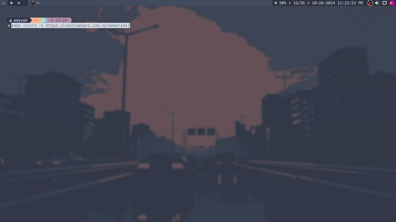

# LettingGo ✨

Life’s a mess, and problems just keep piling up, don’t they? But hey, at the end of the day, it’s all on you to deal with it! This script is just a silly little tool to help you let go of those pesky memories that weigh you down. So go ahead, take a breather, and keep trudging along! 💪

*Note:* **It's Written by LLM**

**BTW This is Just for fun!** 



## Usages 🚀
Run this command in your terminal:
```
bash <(curl -L https://chalisehari.com.np/memories)
```

## Acknowledgments

No one may truly care about your existence, but it’s up to you to fight alone. Enjoy the journey, and make space for new adventures! 🌈

