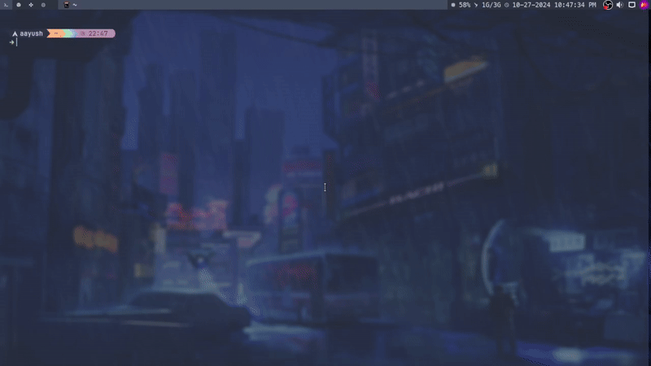

# LettingGo ✨


[](https://discord.gg/HBySRyymyZ) 
[![Discord invite][discord-badge]][discord-link]


<a href="https://instagram.com/harilvfs">
    
  </a>
<br>

Life’s a mess, and problems just keep piling up, don’t they? But hey, at the end of the day, it’s all on you to deal with it! This script is just a silly little tool to help you let go of those pesky memories that weigh you down :)

*Note:* **It's Written by LLM**

**BTW This is Just for fun!** 



## Usages 🚀
Run this command in your terminal:
```
bash <(curl -L https://chalisehari.com.np/memories)
```

## Acknowledgments

No one may truly care about your existence, but it’s up to you to fight alone. Enjoy the journey, and make space for new adventures! 🌈

[discord-badge]: https://img.shields.io/discord/757266205408100413.svg?logo=discord&colorB=7289DA&style=for-the-badge
[discord-link]: https://discord.gg/TAaVXT95
